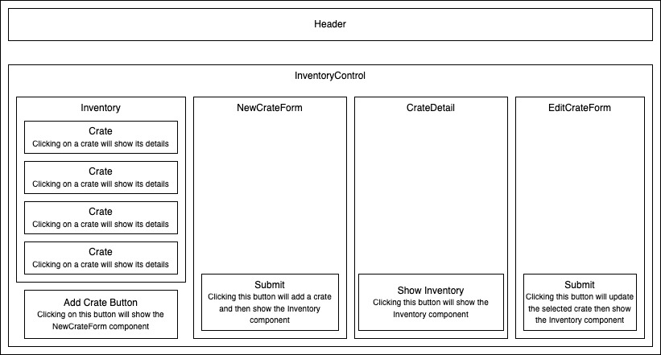

# Piper's Pie Parlor

An application hosting a site that allows the user to add crates of pies to a parlor's inventory.

#### By Kyle Crawford

## Technologies Used

* React
* Webpack

## Description

This application gives the user the ability to keep track of their pie inventory by adding crates of pie (130 pies per crate) to their overall inventory list. There is full CRUD functionality. The user is also able to 'sell' their pies and the app tracks the number of pies left in each crate.

## Component Tree

## How To Run This Project

1. Clone this repo.
2. Open the terminal and navigate to this project's project directory.

## Available Scripts

In the project directory, you can run:

### `npm start`

Runs the app in the development mode.\
Open [http://localhost:3000](http://localhost:3000) to view it in your browser.

The page will reload when you make changes.\
You may also see any lint errors in the console.

### `npm test`

Launches the test runner in the interactive watch mode.\
See the section about [running tests](https://facebook.github.io/create-react-app/docs/running-tests) for more information.

### `npm run build`

Builds the app for production to the `build` folder.\
It correctly bundles React in production mode and optimizes the build for the best performance.

The build is minified and the filenames include the hashes.\
Your app is ready to be deployed!

See the section about [deployment](https://facebook.github.io/create-react-app/docs/deployment) for more information.

## Known Bugs

* None

## License
[MIT](https://opensource.org/license/mit)

Copyright (c) 2023 Kyle Crawford